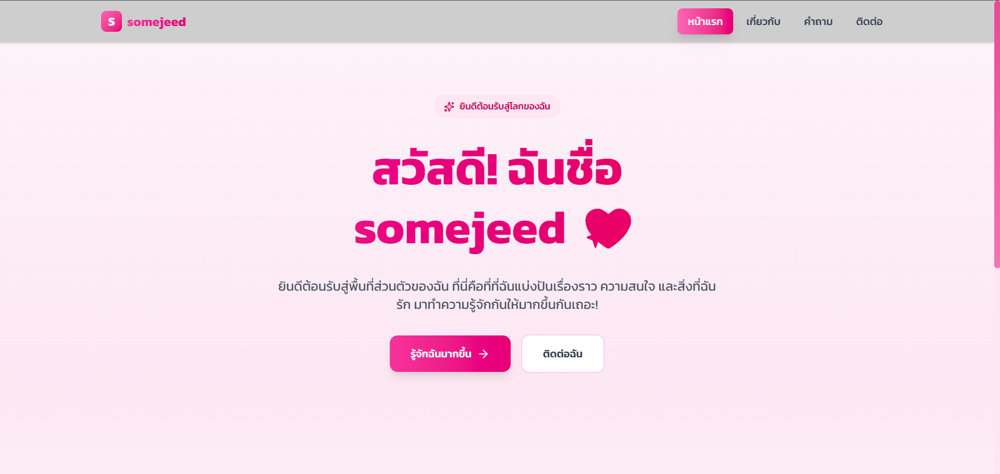

# 💖 somejeed - Personal Website

ยินดีต้อนรับสู่ Repository ของเว็บไซต์ส่วนตัวของ Vasinee Marit (somejeed) ที่สร้างขึ้นเพื่อเป็นพื้นที่สำหรับแบ่งปันเรื่องราว, ความสนใจ, และผลงานต่างๆ ด้วยการออกแบบที่สวยงามและเป็นมิตร



## ✨ เกี่ยวกับโปรเจกต์

โปรเจกต์นี้คือเว็บไซต์ส่วนตัวที่พัฒนาขึ้นด้วยเทคโนโลยีเว็บสมัยใหม่ มีเป้าหมายเพื่อสร้าง Portfolio ออนไลน์ที่สะท้อนตัวตน, ความสามารถ และความคิดสร้างสรรค์ของผู้จัดทำ เว็บไซต์ถูกออกแบบมาให้มีโทนสีชมพูที่สดใสและดูอบอุ่น พร้อมทั้งรองรับการแสดงผลบนทุกอุปกรณ์ (Responsive Design)

### 🌟 คุณสมบัติหลัก

- **หน้าแรก (Homepage):** ส่วนต้อนรับที่น่าประทับใจ พร้อมแนะนำตัวตนเบื้องต้น
- **หน้าเกี่ยวกับ (About):** บอกเล่าเรื่องราว, คุณค่า และสิ่งที่ชอบ เพื่อให้ผู้เยี่ยมชมได้รู้จักกันมากขึ้น
- **หน้าติดต่อ (Contact):** ช่องทางสำหรับติดต่อสื่อสาร
- **โครงสร้างแบบ Component:** แยกส่วนประกอบของ UI เพื่อให้ง่ายต่อการพัฒนาและบำรุงรักษา
- **การออกแบบที่รองรับทุกหน้าจอ:** แสดงผลได้อย่างสวยงามทั้งบนคอมพิวเตอร์, แท็บเล็ต และโทรศัพท์มือถือ

---

## 🚀 เทคโนโลยีที่ใช้

โปรเจกต์นี้สร้างขึ้นด้วยเครื่องมือและไลบรารีที่ทันสมัย เพื่อประสิทธิภาพและความเร็วในการพัฒนา:

- **[Next.js](https://nextjs.org/):** React Framework สำหรับการสร้างแอปพลิเคชันที่รองรับ Server-Side Rendering (SSR) และ Static Site Generation (SSG)
- **[React](https://reactjs.org/):** ไลบรารี JavaScript สำหรับการสร้าง User Interfaces
- **[TypeScript](https://www.typescriptlang.org/):** ช่วยเพิ่ม Type-safety ให้กับ JavaScript ทำให้โค้ดมีคุณภาพและลดข้อผิดพลาด
- **[Tailwind CSS](https://tailwindcss.com/):** Utility-first CSS framework สำหรับการออกแบบ UI ที่รวดเร็วและยืดหยุ่น
- **[Lucide React](https://lucide.dev/):** ชุดไอคอน SVG ที่สวยงามและใช้งานง่าย

---

## 📂 โครงสร้างไฟล์

โครงสร้างของโปรเจกต์ถูกจัดระเบียบตามมาตรฐานของ Next.js App Router เพื่อให้ง่ายต่อการทำความเข้าใจ

```
template_app/
├── app/
│   ├── about/
│   │   └── page.tsx      # หน้าเกี่ยวกับฉัน
│   ├── contact/
│   │   └── page.tsx      # หน้าติดต่อ (คาดการณ์)
│   ├── guestion/
│   │   └── page.tsx      # หน้าคำถาม (คาดการณ์)
│   ├── layout.tsx        # Layout หลักของทุกหน้า
│   ├── page.tsx          # หน้าแรกของเว็บไซต์
│   └── globals.css       # CSS Global
├── components/           # (แนะนำ) โฟลเดอร์สำหรับเก็บ Reusable Components
│   └── ...
├── public/
│   └── ...               # ไฟล์สาธารณะ เช่น รูปภาพ, ไอคอน
├── package.json
└── README.md
```

---

## 🏁 การติดตั้งและเริ่มใช้งาน (Getting Started)

คุณสามารถ Clone โปรเจกต์นี้และรันบนเครื่องของคุณได้ตามขั้นตอนต่อไปนี้

1. **Clone the repository:**
   ```bash
   git clone <your-repository-url>
   cd template_app
   ```

2. **ติดตั้ง Dependencies:**
   ```bash
   npm install
   # หรือ
   yarn install
   ```

3. **รัน Development Server:**
   ```bash
   npm run dev
   # หรือ
   yarn dev
   ```

   เปิดเบราว์เซอร์ไปที่ [http://localhost:3000](http://localhost:3000) เพื่อดูผลลัพธ์

---

## 💖 สร้างด้วยความรัก

© 2025 somejeed